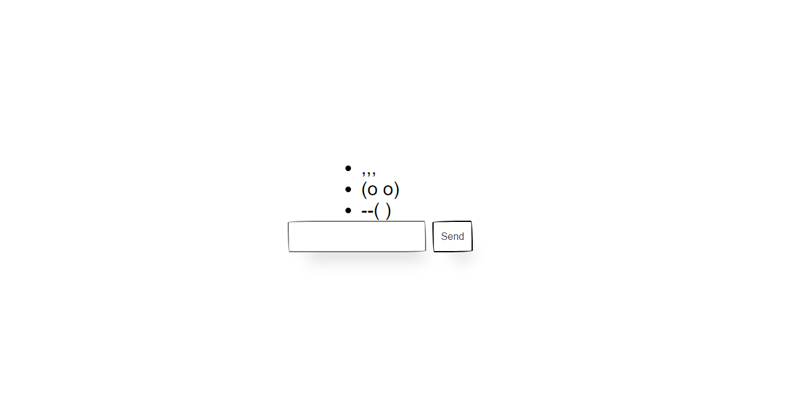

# :pencil2: Projet Chat_Websocket

## Présentation

Bienvenue dans ce projet Chat_Websocket, réalisé par<a href="https://github.com/Chr1stopherPerez" target="_blank"> Christopher PEREZ</a>, une application de chat en temps réel développée avec Node.js, Express, et Socket.IO. L'objectif de cette application est de permettre aux utilisateurs de communiquer instantanément via des messages textuels.

## Structure du Projet

### Fichiers Principaux

#### `index.html`

Le fichier `index.html` est la page principale de l'application. Il contient la structure HTML de l'interface utilisateur du chat, intégrant également les scripts nécessaires.

#### `server.js`

Le fichier `server.js` est le serveur côté serveur qui gère les connexions des utilisateurs, les messages du chat et les événements Socket.IO.

## Fonctionnalités

### Connexion au Serveur

Lorsqu'un utilisateur se connecte à l'application, le serveur Socket.IO détecte cet événement et initialise une connexion WebSocket. Ceci est consigné dans la console du serveur.

### Envoi et Réception de Messages

Les utilisateurs peuvent saisir des messages dans le champ de texte, puis cliquer sur le bouton "Send" pour les envoyer. Ces messages sont transmis au serveur via la connexion WebSocket, puis redistribués à tous les utilisateurs connectés en temps réel.

### Gestion des Déconnexions

Le serveur gère également les événements de déconnexion des utilisateurs. Lorsqu'un utilisateur quitte l'application, un message est affiché dans la console du serveur.

### Captures d'écran



## Installation

1. Clonez le dépôt :

    ```bash
    git clone https://github.com/votre-nom-utilisateur/Chat_Websocket.git
    ```

2. Installez les dépendances nécessaires :

    ```bash
    cd Chat_Websocket
    npm install
    ```

3. Lancez le serveur :

    ```bash
    node server.js
    ```

4. Accédez à l'application dans votre navigateur : [http://localhost:3000](http://localhost:3000)
